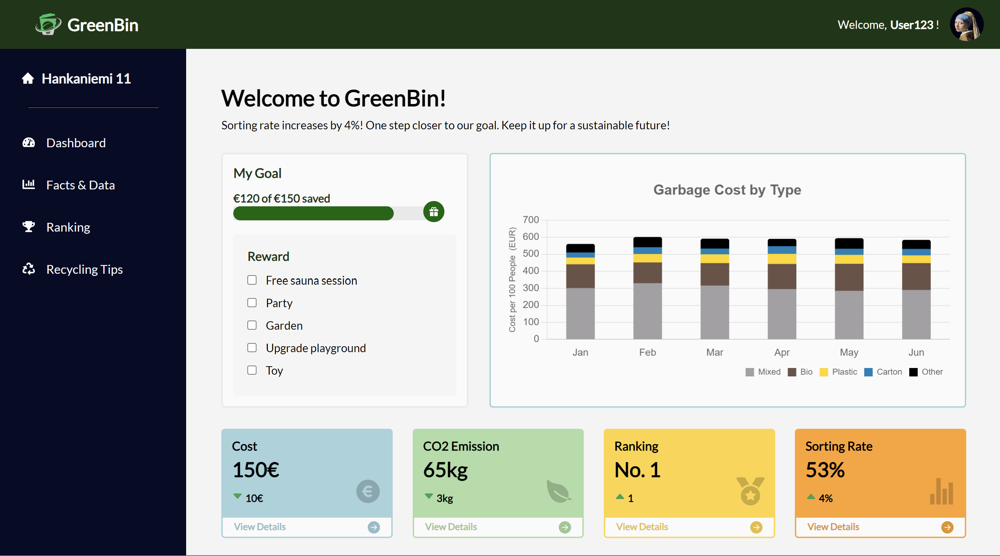
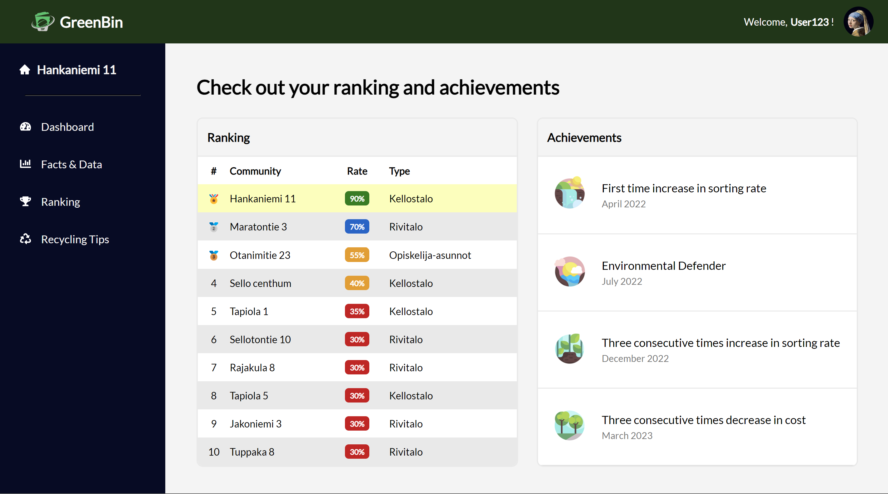

#   Greenbin 

GreenBin is an innovative waste management system that incentivizes residents to increase waste sorting and reduce waste, thus reducing costs and carbon emissions while promoting environmental sustainability.

The platform features reward and ranking system, making waste sorting engaging. Users also have access to a user-friendly dashboard that provides insights into their waste management metrics.

## 🎥 Demo

🌐 [Live Demo](https://wengcychan.github.io/greenbin/) : Greenbin's Website

▶️ [Watch the Video](http://www.youtube.com/watch?v=qWXeDGx8Tdo) : GreenBin's design inspiration, key features and the impact it can bring

## 📸 Screenshots

 
 

## 🛠️ Technologies Used

- React
- JavaScript
- HTML
- CSS

## 🚀 Installation

1. Clone the repository
2. Install dependencies with `npm install`
3. Run the development server with `npm run dev`

## 👥 Contributors

- [Lei](https://github.com/srall123)
- [Linlin Sun](https://github.com/lanximaomao)
- [Xiaoqing](https://github.com/haoking123)

